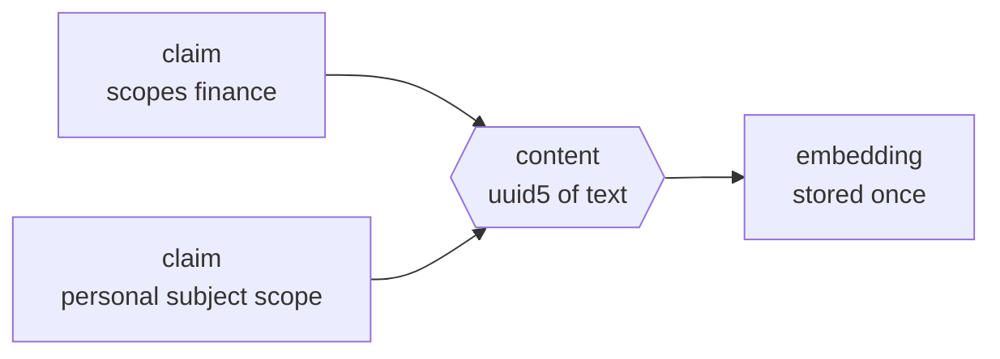
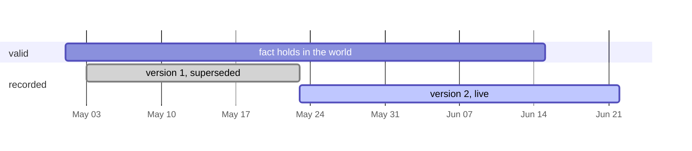

## Content and claim, a union model

Knowledge splits into two tables per kind. Content is the immutable structure, an entity's
normalized name and type or a fact's resolved subject ID, predicate, resolved object ID, and
statement. A `uuid5` addresses those canonical fields. Using resolved endpoint IDs prevents two
same-named entities with different ontology types from collapsing into one fact. Two people
independently extracting the same knowledge mint the same row with no lookup and no coordination.
Claims are per-container stakes on that content, carrying creator provenance, the scope set, the
bi-temporal ranges, and access counters. Dedup across the whole tenancy happens by construction,
and nobody's claim leaks through anyone else's.

RLS hides shared content until the caller has a readable claim. PostgreSQL therefore cannot use
`ON CONFLICT` for content IDs because conflict arbitration applies the table's `SELECT` policy.
`ClaimedContent.mint()` follows SQLAlchemy's PostgreSQL SAVEPOINT pattern instead. It rolls back
only a duplicate key, preserves the surrounding claim transaction, and propagates every other
integrity failure.

## Bi-temporal claims

Every fact claim carries two independent `tstzrange` dimensions. `valid` says when the fact
holds in the world and `recorded` says when this version sat in memory. Nothing is deleted.
A superseding write closes the `recorded` upper bound and inserts a fresh version, so history
is just the closed rows, point-in-time replay is a range predicate the GiST index answers
(measured at 30 ms over 300k claim versions), and Allen-algebra queries come free with the
type.

## Artifacts and object bytes

An `Artifact` is the stable identity of one file or external URI within one exact scope set.
`Artifact.Content` records one immutable original revision together with its companion text,
normalized Markdown, Docling JSON, conversion details, observation time, and expiration time.
Refreshing the same URI and scopes advances the revision without changing old evidence. The
resulting `Document` keeps the stable artifact identity and points to the exact revision that
grounded its text.

A `Blob` represents only an original file. It stores the original UUIDv8 content fingerprint and
size, stored size, storage encoding, opaque object key, storage version, media type, and ETag.
Markdown, JSON, companion text, and conversion metadata stay in PostgreSQL. No generated
derivative becomes another object. The S3-compatible object store owns original bytes, while
forced row security on artifact metadata remains the authority for every read. Object keys are
random and carry no filename, user, organization, source, or digest information.

Object writes use Zstandard only when the encoded payload saves at least five percent by default.
Otherwise the original representation is stored directly. Reads decode transparently, then verify
the original size and UUIDv8 content fingerprint. The object-store client independently requests a
SHA-256 transport checksum for uploads. Compression therefore changes physical storage cost
without changing the logical file or its integrity identity.

Each generated `Document` points to both the stable artifact and the exact original content row.
Recall can therefore expose a compact authorized resource identifier without copying bytes into
the evidence string. Reading that resource requires the caller to pass the same PostgreSQL policy
that made the source visible and verifies the UUIDv8 content fingerprint before returning bytes.

Converted images also receive one supplemental direct vector chunk on that exact document. The
chunk preserves the ordinary document scope and revision boundary. Docling-derived text stays
authoritative, while the direct vector keeps visual meaning that OCR may lose. No second Blob is
created.

Artifact processing state lives on the original content row. The normal path is `pending`,
`queued`, `processing`, and `ready`. Conversion or integrity failures become `failed`. A scheduled
dispatcher finds originals left pending after a process interruption and safely queues them again.
PgQueuer deduplicates jobs by original content ID.

Docling failure does not erase an accepted original. A deterministic fallback `Document` records
the filename, original size, media type, source URI, conversion state, and companion text when one
was supplied. This metadata source participates in text recall. It enters graph projection only
when companion or converted content provides semantic claims worth extracting.

Sharing creates destination-scoped `Artifact` and `Artifact.Content` metadata but points it at the
same immutable `Blob`. The destination has its own RLS boundary and provenance while physical
bytes remain deduplicated. Storage reporting therefore distinguishes logical artifact references
from unique physical Blobs.

## The identity rule

Value objects get `uuid5` and events get `uuid7`. Content is what it says, so its id derives
from the text and a rerun converges on the same graph. A claim is the event of someone saying
it, so its id carries a timestamp prefix and lands writes on one edge of the index. The one
fixed id is a deterministic UUID5 anonymous sentinel. Logto subjects and organizations use UUID5 under
the standard URL namespace with separate user and organization paths.

## Declarative everything

SQLModel classes are the single source of truth. Foreign keys and indexes are field kwargs,
one `Timestamped` mixin carries both audit stamps, and views are first-class citizens. A
`ViewBase` subclass declares typed fields plus the `Select` that is the view and registers itself
when its class body ends. Typed SQLAlchemy DDL compiles it with `security_invoker` so a
view can never accidentally bypass row security. The whole schema regenerates from the models,
and the drift probe diffs compiled RLS policies against the live catalog through sqlglot and
must come back empty.

## The SQLModel boundary

SQLModel owns table entities, relationships, field constraints, every `select` constructor, and
the async session API. AIZK never imports or aliases SQLAlchemy's separate `select` function.
SQLModel `select` with `AsyncSession.exec` keeps scalar model results direct and typed. Projections
wider than SQLModel's four-column typing overload start with up to four columns and append the rest
through `add_columns` on the same statement. SQLAlchemy Core remains the narrow escape hatch for
PostgreSQL array and range operators, CTEs, conflict-aware bulk DML, views, migration DDL, and RLS
expressions.

Patos `FrozenModel` owns immutable values that cross service boundaries, including verified token
standing, queue payloads, and retrieval results. SQLModel table entities remain mutable because
the ORM unit of work manages their database state. Keeping these two roles separate avoids a
second request-model hierarchy without asking one base class to serve incompatible purposes.

Reusable PostgreSQL typing and expression helpers live in the optional `patos[sql]` extra. AIZK
imports the single `patos.sql` namespace for typed columns, JSONB reads, cosine distance, native
enums, t-string expressions, typed `VALUES` relations, and database hashing. Domain models expose
cohesive namespaces such as `Entity.Kind`, `Entity.Content`, `Fact.Claim`, `Fact.Live`, and
`Relation.Policy` instead of a flat list of closely related classes.

Document content identity is a native PostgreSQL UUID. `sql.uuid8` hashes the source with SHA-256
inside PostgreSQL, takes its first 128 bits, and sets the RFC 9562 version and variant fields. The
stored UUID carries 122 digest bits, uses PostgreSQL's compact UUID comparison and indexing, and is
validated as Pydantic `UUID8` whenever it crosses the model boundary.
