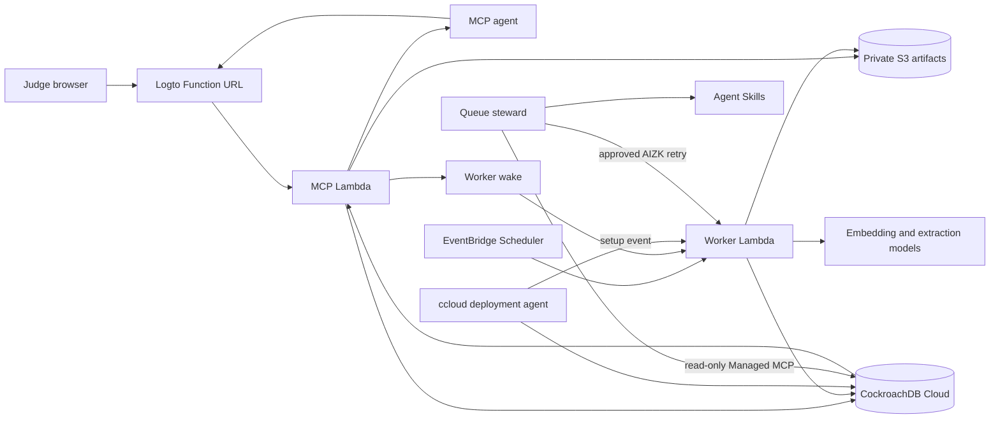

# AIZK architecture

AIZK is the CockroachDB and AWS deployment of AIZK. It gives MCP agents durable, scoped,
temporal memory while keeping source evidence, derived graph knowledge, authorization, vectors,
and queue state transactionally consistent.

## Persistent memory

CockroachDB stores the complete queryable state.

- Immutable document revisions and chunks preserve source provenance.
- Entity and fact claims carry valid time, transaction time, settledness, and grounding.
- Scope arrays and row level security keep private and shared memory separated in the database.
- A private scoped vector projection is the one embedded retrieval surface.
- C-SPANN provides Distributed Vector Indexing without a separate vector database.
- Portable queue tables make background extraction durable across Lambda invocations.
- Usage counters enforce per-user and deployment-wide demonstration limits.

Large embeddings live in separate CockroachDB column families. Composite parent and scope foreign
keys let child policies authorize their indexed scopes without repeating a parent lookup for every
row.

## Agent path

The MCP Lambda serves only the modern MCP `2026-07-28` protocol. `keep` writes authored text or
mints a short-lived capability for one declared file, then wakes the worker. The worker converts
stored files, embeds chunks, extracts graph claims, and commits each durable stage.
`find` embeds one question, runs scoped lexical, vector, graph, temporal, and profile lanes, then
returns source-labelled evidence. The answering agent remains responsible for synthesis.

## CockroachDB tools

Distributed Vector Indexing is in the user request path. The ccloud CLI manages the cluster and SQL
users through a pinned, machine-readable command surface. The queue steward uses fixed CockroachDB
Cloud Managed MCP calls for live read-only cluster and bounded queue evidence. DeepSeek receives a
normalized snapshot without database tools and applies the official cluster health and background
job Agent Skills. The same steward invocation runs one fixed `SHOW JOBS` aggregate through a SQL
login with only `VIEWJOB`, covering the operational state Managed MCP does not expose. A
deterministic policy owns the effective action. Repairs remain bounded AIZK domain commands that
require operator approval. These operator tools never receive an end user's memory request.

## AWS services

AWS Lambda runs the shared website, docs, browser UI, API and MCP surface plus the bounded
worker drain. The same worker accepts an explicit operator-only migration event. A Lambda Function
URL provides the HTTP boundary and Logto protects user requests. EventBridge Scheduler recovers
queued work every fifteen minutes and warms the MCP process every five minutes. A private S3 bucket
stores original artifacts. OAuth state remains in Logto and each client. ECR stores immutable
images. SSM Parameter Store holds secrets. CloudWatch retains logs for seven days. AWS Budgets
tracks gross monthly cost without hiding usage behind credits.

The stack has no API Gateway, VPC, NAT gateway, load balancer, EC2 instance, or always-on
application server.
The account-wide ten-execution Lambda quota, database quotas, short log retention, and a ten dollar
budget bound the demonstration.

## External services

Logto provides OAuth identity and organization standing. OpenRouter routes public demonstration
text to Qwen3 embeddings and DeepSeek extraction. The demonstration key permits provider retention,
so private material is explicitly out of scope.

## Measured limit

Direct scoped C-SPANN execution takes 3 to 7 milliseconds in the local corpus range. The deployed
six-document SWE workload showed that this index is not the end-to-end limit. Warm query embedding
had a 0.47 second warm median, while the composed CockroachDB stage had a 1.55 second median.
The underlying scoped C-SPANN probe executed in 7 ms, so the remaining cost lives in connection,
authority, and composed lane work rather than vector search. AIZK
therefore disables profiles, RAPTOR, reranking, and access recording, but retains source, community,
entity catalog, and graph evidence because those lanes improved answer quality. Source-first packing
prevents broad graph facts from burying direct evidence. [The dated cloud record](PERFORMANCE.md)
keeps these claims separate from the larger local synthetic result.
